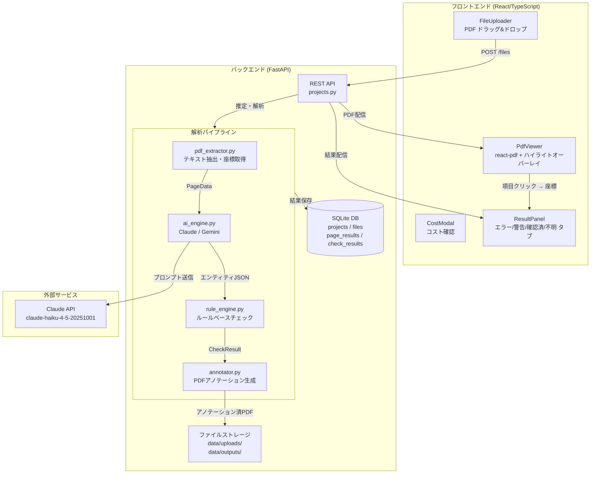
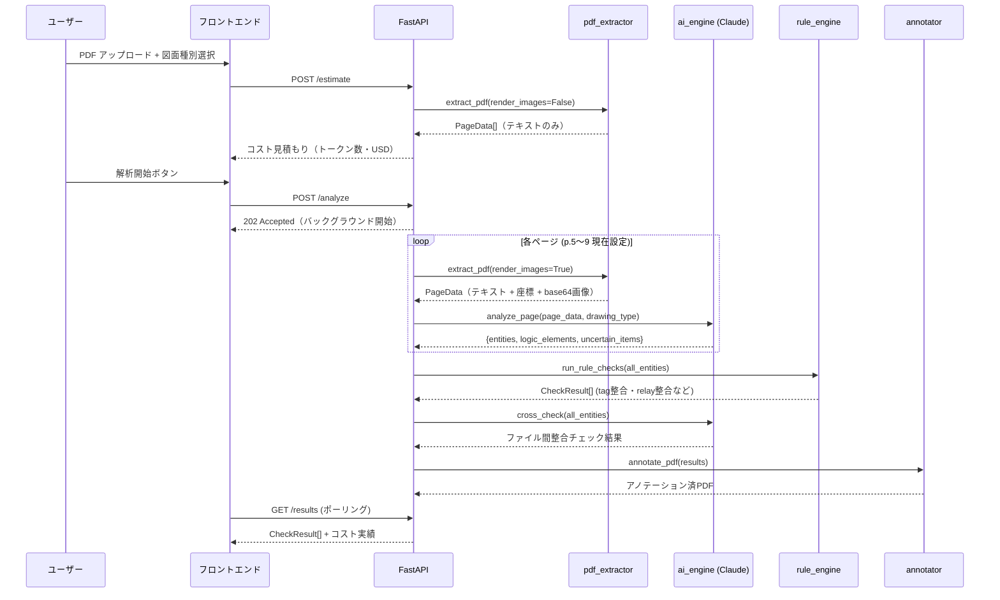

# TBP_check — システムアーキテクチャ概要

claude.ai チャットへの引き継ぎ用ドキュメント。
Panoptic分類・SGG（Scene Graph Generation）適用の設計相談に使用。

---

## 1. システム概要

**目的:** 蒸気タービン起動盤（制御盤）の電気図面PDFをAIで自動検図する  
**主な検図対象:** 展開接続図・シーケンスロジック図・単線結線図  
**主な検図項目:**
- Tag.No 整合（同一機器が全図面で同じ名称か）
- リレーコイル ↔ 接点 のクロスリファレンス整合
- 遮断器定格の JIS 適合性
- 顧客名称の一貫性
- ファイル間（単線図 ↔ 展開図）整合

---

## 2. 技術スタック

| 層 | 技術 |
|---|---|
| フロントエンド | React 18 + TypeScript + Tailwind CSS (Vite, port 3000) |
| バックエンド | Python + FastAPI 非同期 (uvicorn, port 8002) |
| DB | SQLite + SQLAlchemy async (aiosqlite) |
| PDF抽出 | pdfplumber（テキスト・座標）+ PyMuPDF（画像レンダリング・アノテーション） |
| OCR | Tesseract（未インストール）/ pdfplumber のみ現状稼働 |
| AI解析 | Claude API（claude-haiku-4-5-20251001）※ Gemini も切り替え可 |
| アノテーション | PyMuPDF でエラー箇所を色付きハイライト + コメント |

---

## 3. 全体アーキテクチャ図



---

## 4. 解析パイプライン詳細



---

## 5. データモデル

```
Project
├── id, name, status (pending→extracting→analyzing→done/error)
├── estimated_cost_usd, actual_cost_usd
└── DrawingFile[] (1:N)
    ├── id, filename, drawing_type, page_count
    ├── upload_path, annotated_path
    └── PageResult[] (1:N)
        ├── page_number, extracted_text, ocr_used
        ├── entities (JSON)
        └── uncertain_items (JSON)

CheckResult
├── id, project_id, file_id, page_number
├── check_type (tag_consistency / relay_cross_ref / breaker_rating / ...)
├── severity (error / warning / ok / uncertain)
├── message, detail (JSON)
└── location_rect [x0, y0, x1, y1]  ← PDF座標（現状 null が多い）
```

**DrawingType（図面種別）:**
- `external` 外形図
- `parts` 部品図
- `internal_layout` 内部部品配置図
- `single_line` 単線結線図
- `expanded` 展開接続図
- `sequence_logic` シーケンスロジック図

---

## 6. AI解析プロンプト（現在の実装）

各ページに対して以下の構造化JSON抽出をClaudeに依頼：

```
入力: ページ抽出テキスト（pdfplumberによるCAD文字抽出）+ ページ画像(base64)
     ※ OCRなし（Tesseract未インストール）

出力JSON:
{
  "entities": [
    {"tag": "88X", "name": "補助リレー", "rect": [x0,y0,x1,y1]},
    ...
  ],
  "customer_name": "○○電力",
  "electrical_specs": [
    {"type": "voltage", "value": 110, "unit": "V"}
  ],
  "logic_elements": [
    {"type": "coil", "tag": "88X", "page": 5},
    {"type": "contact", "tag": "88X", "page": 6}
  ],
  "uncertain_items": [
    {"text": "不明な記号", "reason": "判断困難"}
  ]
}
```

---

## 7. 現在の問題点（Panoptic/SGG適用の動機）

### 問題①: Tag.No 誤検出（多数の false positive）
- `CT`（電流変換器）、`PS`（圧力スイッチ）、`DCS`、`86`（ANSI番号）など
  一般名詞・略語・ANSI番号をTag.Noと誤認識
- 原因: テキストのみを解析するためコンテキスト（どんなシンボルか）が分からない

### 問題②: location_rect が null
- AIがテキストから座標を推定しているが精度が低く、ほぼnullを返す
- クリックしてもPDFビューアのハイライトが動作しない

### 問題③: OCRなしの限界
- CAD生成PDFなので現状は問題ないが、スキャン図面には対応不可

### 問題④: 構造理解の欠如
- テキスト列を解析しているだけで、図面の「接続構造」を理解できていない
- リレーのコイルと接点がどの線で繋がっているかを把握できない

---

## 8. Panoptic/SGG 適用で期待する改善

現在: `テキスト抽出 → Claude APIで意味解析`（セマンティックのみ）

導入後の想定:
```
PDF → ページ画像レンダリング
     → Panoptic Segmentation（シンボル領域 vs 配線領域 vs テキスト領域）
     → SGG（シンボル間の接続関係をグラフ化）
     → グラフ構造 + テキスト情報をClaudeに渡す
     → 構造を理解した高精度検図
```

期待効果:
- Tag.No誤検出の削減（シンボル種別を視覚的に判別）
- location_rectの正確な取得（Panopticの出力が座標を持つ）
- 接続関係の把握（SGGでコイル→接点の繋がりを把握）

---

## 9. 現在のファイル構成

```
drawing-checker/
├── backend/
│   ├── app/
│   │   ├── main.py
│   │   ├── core/
│   │   │   ├── config.py       ← AI_ENGINE, PAGE_START/END 等
│   │   │   └── database.py
│   │   ├── api/
│   │   │   └── projects.py     ← REST APIエンドポイント
│   │   ├── models/
│   │   │   └── project.py      ← SQLAlchemy ORM
│   │   ├── schemas/
│   │   │   └── project.py      ← Pydantic スキーマ
│   │   └── services/
│   │       ├── analysis_pipeline.py  ← オーケストレーター
│   │       ├── ai_engine.py          ← Claude/Gemini抽象クラス
│   │       ├── annotator.py          ← PyMuPDFアノテーション
│   │       ├── pdf_extractor.py      ← pdfplumber + PyMuPDF
│   │       ├── rule_engine.py        ← ルールベースチェック
│   │       └── text_normalizer.py    ← NFKC正規化等
│   ├── requirements.txt
│   └── venv/
├── frontend/
│   ├── src/
│   │   ├── components/
│   │   │   ├── PdfViewer.tsx   ← react-pdf + ハイライトオーバーレイ
│   │   │   ├── ResultPanel.tsx ← 検図結果タブ表示
│   │   │   ├── FileUploader.tsx
│   │   │   └── CostModal.tsx
│   │   ├── pages/
│   │   │   ├── WorkspacePage.tsx
│   │   │   └── HomePage.tsx
│   │   ├── types/index.ts
│   │   └── utils/api.ts
│   └── public/
│       └── pdf.worker.min.mjs  ← pdfjs workerバイナリ
└── data/
    ├── uploads/    ← アップロードPDF
    └── outputs/    ← アノテーション済PDF
```

---

## 10. GitHubリポジトリ

https://github.com/Toguhiro/TBP_check

ブランチ: `main`
